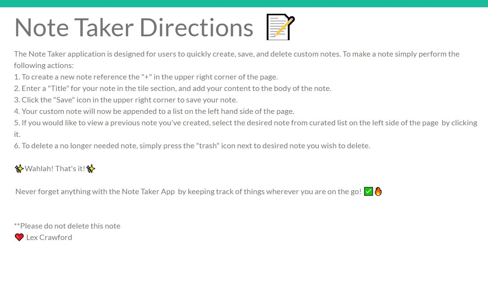
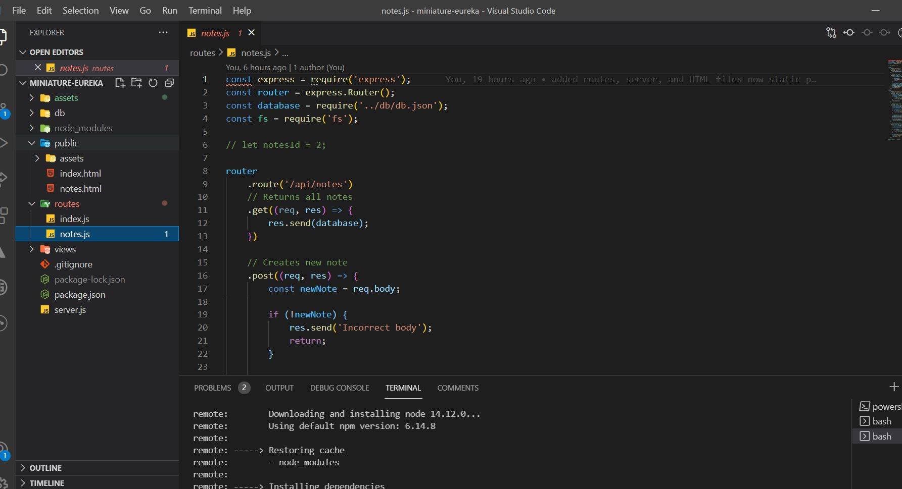
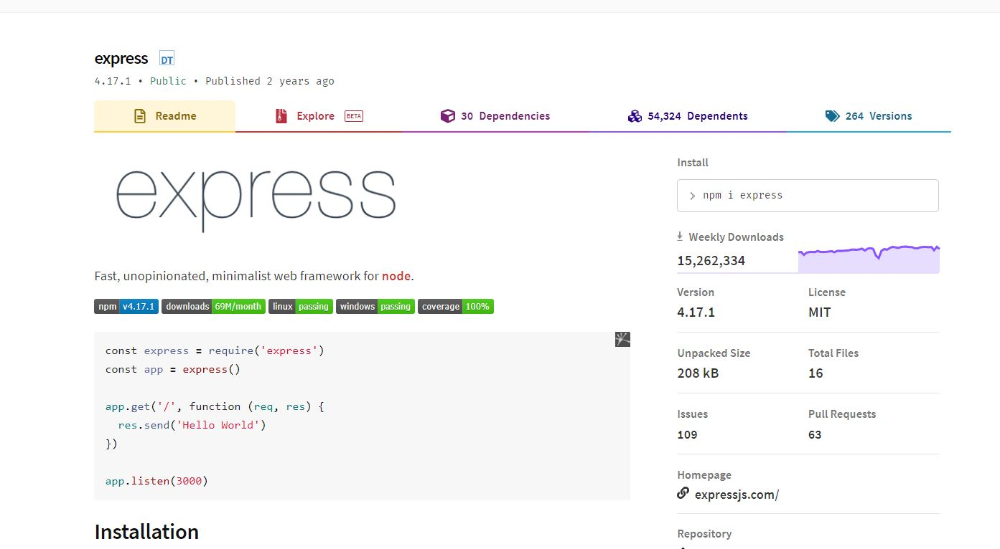
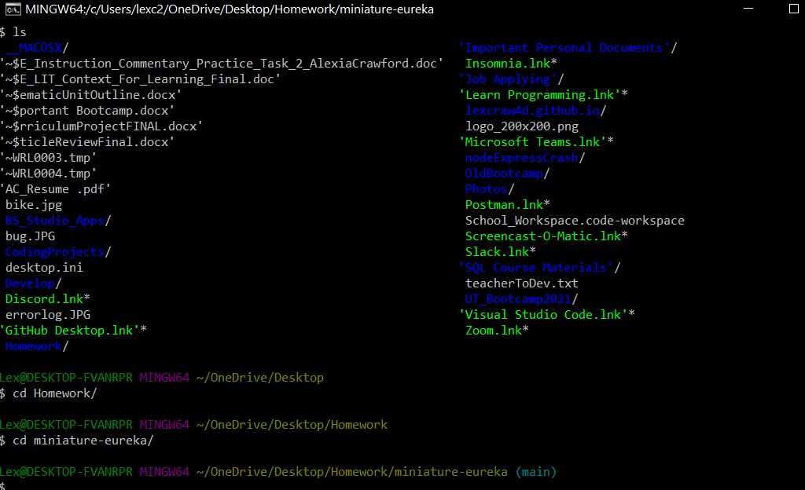

# Note Taker App

#### Table of Contents

- [About](#About)
- [Installation](#Installation)
- [Usage](#Usage)
- [Contribution](#Contribution)
- [License](#License)

# About

The Note Taker Application was designed for users to create custom notes on-the-go. The Note Taker App allows users to create, save, and delete notes. The Note Taker App was created using [Visual Studio Code](https://code.visualstudio.com/), [Node.js](https://nodejs.org/en/),[Node Package Manager (npm)](https://www.npmjs.com/),[Heroku](http://heroku.com/), and [Express](https://expressjs.com/).
Please visit [this video](https://drive.google.com/file/d/1YBGQGzkXizTpFmDODRhGQycl0UWuVa2X/view?usp=sharing) for a live demo, since all of the generator is made via the command line.

# Installation

To install please visit [my repository](https://github.com/lexcraw4d/miniature-eureka) and look at the uploaded files via GitHub Deployment. You may fork my repository and download [Node.js](https://nodejs.org/en/) Additionally, you will need [Visual Studio Code](https://code.visualstudio.com/), [npm](https://www.npmjs.com/), and [Express](https://www.npmjs.com/package/express).The details of how to implement these are provided in the [Usage](#Usage) section below.

# Usage

##### Visual Studio Code

Visual Studio Code (VS) was used to create, edit, and code the Team Profile Generator.

[Visual Studio Code](https://code.visualstudio.com/) is an lightning fast FREE open-source editor designed by [Microsoft](https://www.microsoft.com/en-us/) with developers in mind. Visual Studio code allows developers to easily apply the edit-build-debug cycle, resulting in more productivity on your ideas.

[Visual Studio Code](https://code.visualstudio.com/) brings all that you need as a developer, such as: debugging, instant editing results, customization specifically designed for your preference, hundreds of languages, extensions, version control, and more all at your fingertips!

### Node.js

Node.js was used in combination with VSC. You can dowload Node.js [here](https://nodejs.org/en/).

### npm

[npm](https://www.npmjs.com/package/inquirer) was used in combination with [Express](https://expressjs.com/) to create a backend middleware server. Please click the referenced information for documentation on npm and Express.

### Directions

To run the [Note Taker App](https://note-taker-app-aac.herokuapp.com/) please click the link and follow these directions:

The Note Taker application is designed for users to quickly create, save, and delete custom notes. To make a note simply perform the following actions:

1. To create a new note reference the "+" in the upper right corner of the page.
2. Enter a "Title" for your note in the tile section, and add your content to the body of the note.
3. Click the "Save" icon in the upper right corner of the page to save your note.
4. Your custom note will now be appended to a list on the left hand side of the page.
5. If you would like to view a previous note you created, select the desired note from the curated list on the left side of the page by clicking it.
6. To delete a no longer needed note, simply press the "Trash" icon next to the desired note you wish to delete.

✨Wahlah! That's it!✨

Never forget anything with the Note Taker App by keeping track of things whenever and wherever you are on the go! ✅🔥

#### GitHub/Git

In order to make effective changes to the website both [Git](https://gitforwindows.org/) and [GitHub](https://github.com/) were used in synchronization to push commits of the latest updated version.

Git is version control system which allows multiple users to make changes to one single repository.

GitHub is a corporation which provides hosting for version control using Git and software development. [GitHub Docs ](https://docs.github.com/en/free-pro-team@latest/github/setting-up-and-managing-your-github-user-account/managing-user-account-settings) provides all needs for setting up your GitHub and answering problem-solving issues you may come across while using GitHub.

# Contribution

Feel free to contribute to this project in any of the following ways:

- [Submit bug and feature requests](https://github.com/lexcraw4d/miniature-eureka/issues)
- [Review Source Code Changes](https://github.com/lexcraw4d/miniature-eureka/pulls) and make pull requests from typos to content
- For specific concerns that do not meet the above please do not hesitate to reach out to me via [My GitHub](https://github.com/lexcraw4d).

If you are interested in fixing issues directly to the code base, please reference the [How to Contribute](https://github.com/microsoft/vscode/wiki/How-to-Contribute) article.

# License

This source code is available to everyone under the standard [MIT License](https://github.com/microsoft/vscode/blob/master/LICENSE.txt).

:copyright: 2021 Lexie Crawford :computer: :heart:
